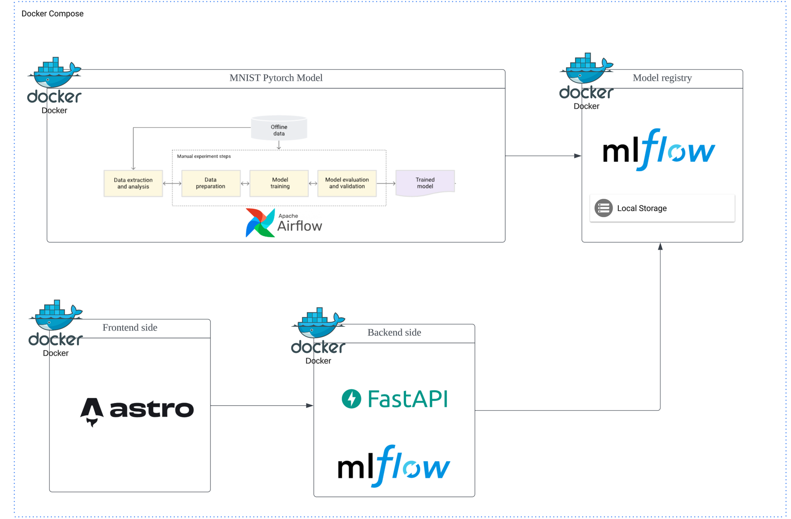

# MNIST-operation-pipeline
                         

## Environment

1. Python version 3.11.5(pyenv, MNIST-operation-pipeline)
                                

## Quick Start
                            
### Pyenv setup(local environment)
- [Pyenv installation guide documentation](https://github.com/pyenv/pyenv#installation)

```bash
$ pyenv install 3.11.5
$ pyenv virtualenv 3.11.5 MNIST-operation-pipeline
$ pyenv local MNIST-operation-pipeline  
```

### Run All system
```bash
docker compose up # flags are up to you.
```


### Architecture



<br><br>

## The points you should know

- At first, when you run the project, it retries for 1200 seconds until a model is created in the backend because there is no registered model (I want to minimize the work), so at first you have to wait without any logs until the MNIST model is trained and saved in mlflow. (You can refer to app.py on the backend)


## MNIST datasets
- https://www.kaggle.com/datasets/scolianni/mnistasjpg/

