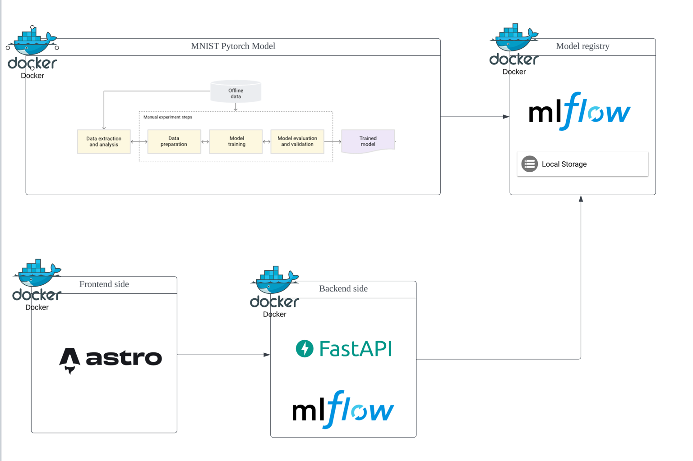

# MNIST-operation-pipeline
                         

## Environment

1. Python version 3.11.5(pyenv, MNIST-operation-pipeline)
                                

## Quick Start


### Warning
> The default amount of memory available for Docker on macOS is often not enough to get Airflow up and running. If enough memory is not allocated, it might lead to the webserver continuously restarting. You should allocate at least 4GB memory for the Docker Engine (ideally 8GB).

-  For documentation on setting up and running Docker Compose, see [Airflow Docs](https://airflow.apache.org/docs/apache-airflow/stable/howto/docker-compose/index.html).


## Run Docker
```bash
# Make sure to initialize Docker settings based on the above airflow documentation
docker compose build
docker compose up
```
                 
## Process of what you have to do first
1. go into Airflow web UI(id: airflow, pw: airflow)
 - Docker may take a while to load initially, so it may take a while to access it.
2. run mnist-gpu task once in the Airflow
3. Once the task in Airflow completed, move FE site
4. download one mnist data image in the internet and predict 
5. that's all!


### Architecture

     
#### Links

MLFlow UI
- localhost:5001

Airflow web UI
- localhost:8080

FE
- localhost:4321 

BE
- localhost:8000


<br><br>

## The points you should know

- At first, when you run the project, it retries for 1200 seconds until a model is created in the backend because there is no registered model. so once airflow is running, connect to webserver (localhost:8080) and start the pipeline if it hasn't already been started. 
- Once the ML model is trained by the pipeline automation, it should work fine and run. You can check the automated MNIST application through FE (localhost:4321).


## MNIST datasets
- https://www.kaggle.com/datasets/scolianni/mnistasjpg/

